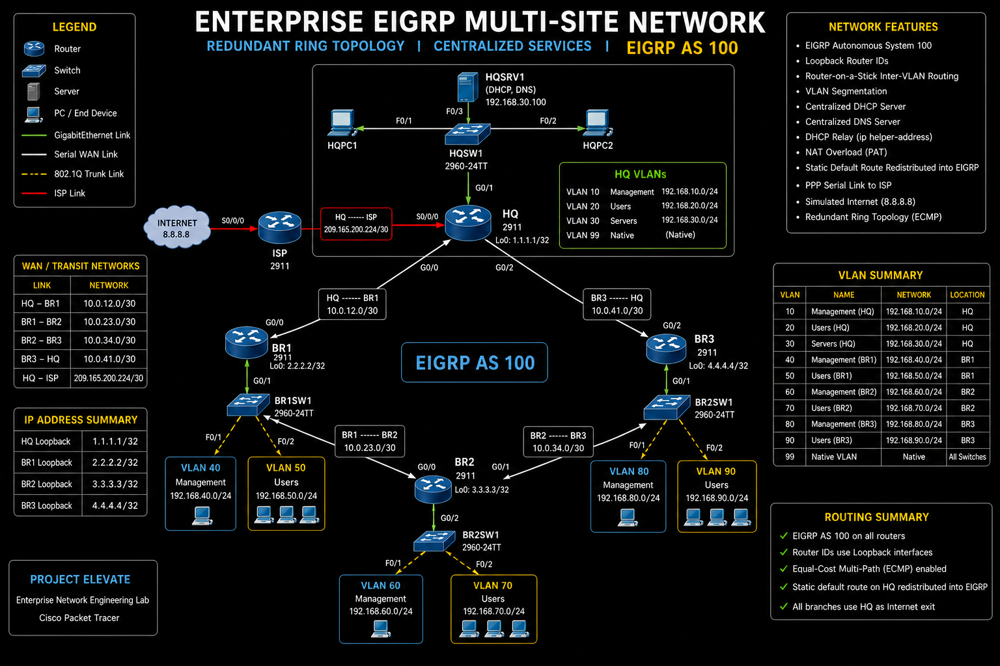

# Enterprise EIGRP Multi-Site Network

> Enterprise campus network built in Cisco Packet Tracer demonstrating EIGRP routing, router redundancy, centralized DHCP, DNS, NAT/PAT, DHCP Relay, Router-on-a-Stick, and enterprise verification.

---

# Project Overview

This project simulates a multi-site enterprise network consisting of one headquarters and three branch offices connected in a redundant ring topology using Cisco Enhanced Interior Gateway Routing Protocol (EIGRP).

The goal of the project was to design, configure, verify, troubleshoot, and document an enterprise network using industry best practices while demonstrating skills expected of a Network Engineer.

---

# Objectives

- Design an enterprise multi-site topology
- Deploy EIGRP Autonomous System 100
- Implement Router-on-a-Stick inter-VLAN routing
- Configure centralized DHCP services
- Configure DNS services
- Configure DHCP Relay using ip helper-address
- Configure PAT (NAT Overload)
- Redistribute a default route into EIGRP
- Verify end-to-end connectivity
- Produce professional documentation

---

# Enterprise Topology



---

# Network Features

- Headquarters and three branch offices
- Full enterprise ring topology
- EIGRP AS 100
- Loopback Router IDs
- Router-on-a-Stick VLAN routing
- VLAN segmentation
- Centralized DHCP Server
- Centralized DNS Server
- DHCP Relay
- NAT Overload (PAT)
- Serial WAN Connection (Cisco HDLC)
- Static default route redistribution
- Simulated Internet (8.8.8.8)
- End-to-end verification

---

# VLAN Design

| VLAN | Purpose | Network |
|------|----------|-------------|
|10|Management|192.168.10.0/24|
|20|Users|192.168.20.0/24|
|30|Servers|192.168.30.0/24|
|40|BR1 Management|192.168.40.0/24|
|50|BR1 Users|192.168.50.0/24|
|60|BR2 Management|192.168.60.0/24|
|70|BR2 Users|192.168.70.0/24|
|80|BR3 Management|192.168.80.0/24|
|90|BR3 Users|192.168.90.0/24|
|99|Native VLAN|Native|

---

# Technologies Used

- Cisco Packet Tracer
- Cisco IOS
- EIGRP
- Router-on-a-Stick
- VLANs
- DHCP
- DNS
- NAT/PAT
- DHCP Relay
- HDLC
- Static Routing
- Route Redistribution

---

# Repository Structure

```
03-Enterprise-EIGRP-Multi-Site-Network
│
├── Configs/
│   ├── HQ.txt
│   ├── BR1.txt
│   ├── BR2.txt
│   ├── BR3.txt
│   ├── HQSW1.txt
│   ├── BR1SW1.txt
│   ├── BR2SW1.txt
│   └── BR3SW1.txt
│
├── Documentation/
│   ├── Configuration-Guide.md
│   ├── Verification.md
│   ├── Troubleshooting.md
│   └── Lessons-Learned.md
│
├── Images/
│
├── Packet-Tracer/
│
└── README.md
```

---

# Verification Summary

The completed network was verified through:

- Routing table verification
- EIGRP neighbor verification
- EIGRP topology verification
- Interface verification
- VLAN verification
- DHCP verification
- DNS verification
- NAT translation verification
- End-to-end client connectivity
- Internet connectivity
- Traceroute validation

All routers successfully exchanged routes and all branch clients received DHCP leases while maintaining Internet connectivity through PAT.

---

# Skills Demonstrated

- Enterprise Network Design
- Cisco IOS Configuration
- Dynamic Routing (EIGRP)
- VLAN Implementation
- Router-on-a-Stick
- DHCP Configuration
- DHCP Relay
- DNS Configuration
- NAT/PAT
- Serial WAN Connection (Cisco HDLC)
- Route Redistribution
- Enterprise Network Verification
- Network Troubleshooting
- Technical Documentation

---

# Documentation

| Document | Description |
|-----------|-------------|
|Configuration Guide|Complete deployment walkthrough|
|Verification|Device validation and testing|
|Troubleshooting|Issues encountered and resolutions|
|Lessons Learned|Project reflections and improvements|

---

# Future Improvements

- IPv6 implementation
- Dual ISP connectivity
- HSRP gateway redundancy
- EtherChannel
- Layer 3 switching
- ACL security
- SNMP monitoring
- Syslog server
- NTP synchronization
- AAA authentication

---

# Author

**Elroy Noel**

Aspiring Network Engineer

- CCNA Certified
- Building enterprise networking projects
- Learning advanced routing and switching
- GitHub Portfolio: https://github.com/elroynoel-ctrl
